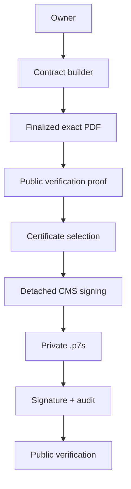

# Digital Sign Master Degree

Aplikacija za digitalno potpisivanje dokumenata — diplomski (master) projekt.
Konkretni implementirani tok je **kupoprodajni ugovor o motornom vozilu**: zaposlenik
kroz builder unosi podatke o prodavatelju, kupcu, vozilu i cijeni, sprema ih kao JSON
snapshot, finalizira i zaključava ugovor, generira nepromjenjivi finalni PDF, po želji
aktivira javnu provjeru hash vrijednosti bez prijave te nad zamrznutim PDF-om izrađuje
**lokalni akademski detached CMS/PKCS#7 potpis**.

## Status

```text
Status:                                          lokalni akademski prototip
M10–M12 signing workflow:                        COMPLETED
M13 final validation & thesis readiness:         COMPLETED
M14 — Certificate request and controlled
     issuance workflow:                          IMPLEMENTATION COMPLETE — pending independent audit
Production deployment:                           nije cilj trenutačnog scopea
```

Signing workflow (M10 servis → M11 orkestracija/persistencija → M12 korisnički sloj) je
funkcionalno zaokružen. M14 dodaje korisnički tok zahtjeva za certifikatom i kontrolirano
lokalno izdavanje (operater → atomski database queue → dedicated worker → per-user leaf
certifikat → `SignerCertificateRegistrar`). M14 je implementiran, ali **još nije neovisno
auditiran ni zatvoren**.

## Projekt i opseg

- **Cilj:** demonstrirati cjelovit lokalni tok od izrade ugovora do provjerljivog,
  kriptografski potpisanog artefakta u akademskom okruženju.
- **Lokalni akademski opseg.** Digitalni potpis je **detached CMS/PKCS#7** potpis nad
  zamrznutim finalnim PDF-om, pohranjen kao **zaseban `.p7s` artefakt** (PDF se ne
  mijenja). Potpis i provjera izvode se kroz PHP `ext-openssl` (`openssl_cms_sign` /
  `openssl_cms_verify`) protiv lokalnog testnog Root CA.
- **Što ovo NIJE.** Nije PAdES ni embedded PDF potpis; nije eIDAS, QES, QSCD, QTSP ni
  AdES; nije kvalificirani certifikat ni potpis; nema pravnu snagu, non-repudiation ni
  ekvivalenciju vlastoručnom potpisu. Trust anchor je **self-signed testni** Root CA.
- **Nema produkcijskog deploya.** Sve je namijenjeno lokalnom `local`/`testing`
  okruženju; nema CI-ja u repozitoriju.
- **Potpisnik = tehnički vlasnik zapisa** (`signed_user_id`), nikad dokaz da je
  prodavatelj ili kupac potpisao. Vidi „Shared-key model" niže.

## Ključne funkcionalnosti

- Autentifikacija (register/login/logout) i owner authorization na svim contract akcijama.
- Korisnički profil i contract builder s live pregledom.
- Snapshot (JSONB), finalizacija sa zaključavanjem i create-only finalni PDF.
- Vehicle catalog autocomplete (read-only spec katalog).
- Documents modul (owner/purpose-scoped upload/list/open).
- Javna hash/QR provjera bez prijave i bez otkrivanja sadržaja.
- Per-user X.509 signer certifikat (shared privatni ključ, vidi granice).
- Detached CMS/PKCS#7 potpis kao zaseban `.p7s` artefakt.
- Signing audit i perzistirani javni prikaz potpisnog statusa (8 odvojenih signala).
- Privatna pohrana i exact source→PDF integrity binding.
- **M14 — zahtjev i kontrolirano izdavanje certifikata:** korisnik podnese zahtjev →
  `certificate_operator` odobri → approval atomski (isti database queue) stvara jedan
  issuance job → dedicated worker izdaje per-user leaf certifikat i atomski veže
  `Certificate`, `issued` status i completion audit. State machine, PostgreSQL constraint
  shape, operator authority locking i audit allow-lista čuvaju invarijante.

## Arhitektura



Detaljniji dijagrami (komponente, lifecycle, signing sequence) su u
[docs/thesis-evidence/](docs/thesis-evidence/).

## Stack

| Sloj | Tehnologija | Zahtjev |
|---|---|---|
| Jezik | PHP | `^8.3` (auditirano lokalno: 8.3.12, ZTS, Visual C++ 2019 x64) |
| Framework | Laravel | `^13.8` (auditirano lokalno: 13.16.1) |
| Runtime baza | PostgreSQL | driver `pgsql` (auditirano lokalno: server 18.4) |
| Test harness (default) | SQLite `:memory:` | samo za brzi izolirani test baseline — **nije** runtime baza |
| PDF | `barryvdh/laravel-dompdf` | `^3.1` |
| QR | `bacon/bacon-qr-code` | `^3.0` |
| Kriptografija | PHP `ext-openssl` | `openssl_cms_sign` / `openssl_cms_verify`, X.509 parse/fingerprint |
| Frontend | Blade + Tailwind CSS v4 preko **Browser CDN** (`@tailwindcss/browser@4`) | bez Node/Vite/npm build koraka |
| Test / lint | PHPUnit `^12.5`, Laravel Pint `^1.27` | — |

Napomene:

- **PostgreSQL verzija.** PostgreSQL je runtime baza. Auditirano lokalno razvojno okruženje
  koristi **PostgreSQL 18.4**. Minimalna podržana PostgreSQL verzija **nije zasebno utvrđena
  compatibility testiranjem** — kod nije namjerno vezan uz jednu verziju, ali širi raspon nije
  dokazan izvršno.
- **Bez frontend builda.** `package.json`/`vite.config.js` postoje kao naslijeđeni
  Laravel scaffolding, ali nijedan Blade view ne koristi `@vite(...)`; aplikacija radi
  bez `npm run build`. Ne uvoditi Node/Vite/npm kao runtime ovisnost.

## Instalacija

```bash
# 1. Ovisnosti
composer install

# 2. .env
cp .env.example .env

# 3. Application key
php artisan key:generate

# 4. PostgreSQL baza
#    Kreiraj bazu (naziv iz .env, default: digital_sign_master_degree) na lokalnom
#    PostgreSQL serveru i upiši DB_HOST/DB_PORT/DB_DATABASE/DB_USERNAME/DB_PASSWORD u .env.

# 5. Migracije (forward-only)
php artisan migrate

# 6. Storage
#    Privatni dokumenti žive na disku `local` s rootom storage/app/private i NE serviraju
#    se javno. `php artisan storage:link` NIJE potreban za privatni tok.

# 7. Pokretanje
php artisan serve
```

> Nikad ne pokreći `migrate:fresh`, `migrate:refresh`, `migrate:reset`, `migrate:rollback`,
> `db:wipe` ni destruktivne DROP/TRUNCATE naredbe nad razvojnom bazom. Migracije su
> forward-only.

## Local signer provisioning (samo local/testing)

Lokalni testni potpisni identitet izdaje se Artisan naredbom. Naredba radi **isključivo**
u `local`/`testing` okruženju; u produkciji je uvijek odbijena.

```bash
# <USER_ID> je postojeći numerički ID korisnika (nikad se ne kreira automatski).
php artisan signing:provision-local-signer <USER_ID>
```

- **Project-local, Git-ignored root:** `storage/app/private/signing/local` (cijelo stablo
  je gitignored eksplicitnim pravilom). Iznimka od „materijal izvan repozitorija" pravila
  vrijedi **samo** u local/testing; u produkciji to pravilo ostaje apsolutno.
- **Datoteke koje nastaju (samo naziv/purpose, nikad sadržaj ključa/passphrasea):**
  - `test-root-ca.pem` — lokalni testni Root CA **certifikat** (trust anchor).
  - `test-root-ca-key.pem` — provisioning-only CA privatni ključ; služi samo za izdavanje
    certifikata idućem korisniku iz istog trust anchora. **Nikad** nije referenciran u
    `config/signing.php` ni učitan u signing runtimeu.
  - `test-signer-cert.pem` — javni signer certifikat.
  - `test-signer-key.pem` — signer privatni ključ (zajednički, vidi niže).
  - `test-signer-passphrase.txt` — passphrase datoteka (passphrase se čita iz datoteke,
    nikad iz config stringa).
- **Kako korisnik dobiva `Certificate` zapis:** naredba kroz `SignerCertificateRegistrar`
  parsira i validira javni signer certifikat (profil `CA:FALSE`, `digitalSignature`,
  validity, key-match, SMIME trust) i registrira `certificates` redak vezan uz korisnika
  (vlastiti serial → vlastiti globalno-unique SHA-256 thumbprint), s `is_active = true`.
- **Shared signer private-key model.** Prototip koristi **jedan zajednički** privatni
  ključ, centralno pohranjen u signing rootu; svakom korisniku izdaje se **zaseban** X.509
  certifikat. Korisnik **osobno ne posjeduje** ni ne kontrolira privatni ključ, pa identitet
  potpisnika proizlazi iz aplikacijske autentikacije, autorizacije, certificate bindinga i
  audita — ne iz isključivog posjeda ključa. Zato **nema non-repudiationa**.
- **Uloga Root CA privatnog ključa:** isključivo provisioning (izdavanje daljnjih signer
  certifikata iz istog trust anchora). Nije runtime ovisnost i ne konfigurira se.
- Ispis naredbe **ne prikazuje** privatni ključ, passphrase ni apsolutne putanje.

## Certificate request and controlled issuance (M14)

Uz ručni provisioning, M14 dodaje korisnički tok u kojem certifikat izdaje **dedicated
worker** nakon operaterovog odobrenja:

```text
korisnik podnese zahtjev
  → certificate_operator odobri
  → approval atomski (isti database queue, isti connection) stvara jedan issuance job
  → dedicated worker preuzme isti request/attempt (approved → issuing)
  → izda se zaseban per-user X.509 leaf certifikat (native ext-openssl)
  → SignerCertificateRegistrar validira profil, key-match i trust te registrira Certificate
  → Certificate + issued status + completion audit završe atomski
  → korisnik u UI-u vidi issued ili failed
```

- **Operator bootstrap (lokalno):** dodijeli/oduzmi ulogu
  `php artisan certificate-operator:grant <USER_ID>` (`--revoke` za oduzimanje). Naredba
  koristi isti authority locking protokol (user-row → pivot `FOR UPDATE`) kao review tok.
- **Dedicated worker (pokreni tek nakon pune M14 implementacije):**

  ```powershell
  php artisan queue:work database --queue=certificate-issuance --tries=3
  ```

  `certificate-issuance` je **zaseban** queue; default queue listener ili `composer dev` ga
  **ne konzumiraju** osim ako je izričito tako konfiguriran, pa globalno queue ponašanje
  ostaje nepromijenjeno.
- **Zajednički servis:** i provisioning naredba i worker koriste isti
  `LocalSignerCertificateIssuanceService` za per-user leaf issuance i isti
  `SignerCertificateRegistrar`. Samo naredba smije **bootstrapati/oporaviti** Root CA + ključeve
  + passphrase; worker izdaje **isključivo** iz već postojećeg, strukturno potvrđenog roota i
  fail-closed odbija ako root nije potpun/siguran/valjan.
- **Root CA privatni ključ = local/testing issuance-plane only:** učitavaju ga samo
  bootstrap naredba, worker i njihov zajednički servis. **Nikad** HTTP controller, Form Request,
  Blade view, normalni CMS document-signing servis, javna provjera, queue serializer, audit ni
  logger. Nije opcija u `config/signing.php` koju čita signing runtime.
- **Shared signer key, per-user certifikat:** kao i kod provisioninga — svi dijele jedan
  privatni ključ, svatko dobiva zaseban certifikat, korisnik ključ **ne dobiva**, nema
  non-repudiationa. Leaf subject ne sadrži OIB/ime/e-mail ni druge PII podatke.
- **Job business payload:** samo `certificate_request_id` + `issuance_attempt_id`; nikad model,
  korisnik, napomena, putanja ni tajna. Worker sve ostalo ponovno čita iz baze pod lockom.
- **Audit događaji:** `certificate.issuance.started`, `certificate.issuance.completed`,
  `certificate.issuance.failed` (`success=false`). Actor je konkretni operater
  (`reviewed_by_user_id`), nikad `auth()`. Metadata je stroga allow-lista (operation, statusi,
  request/subject/operator id, `certificate_id` kod issued, `failure_code` kod failed,
  `compensation_incomplete` kad treba) — bez napomena, PII-ja, DN-a, seriala, attempt UUID-a,
  putanja, PEM-a ni raw errora.
- **Failure/retry granica:** trajni sigurnosni/domenski failure zapisuje terminalni `failed`
  samo iz `issuing`, sa stabilnim `failure_code` (npr. `ISSUANCE_SIGNING_ROOT_UNAVAILABLE`,
  `ISSUANCE_ACTIVE_CERTIFICATE_EXISTS`, `ISSUANCE_COMPLETION_UNSAFE`), bez raw exceptiona.
  Prolazni lock/deadlock se **ne** zapisuje terminalno — job retryira isti attempt; tek
  iscrpljeni retryji označe `ISSUANCE_RETRIES_EXHAUSTED`. `failed` je terminalno i nikad se ne
  vraća u `approved`/`issuing`.

## Workflow

```text
profile (opcionalni podaci korisnika)
  → contract builder (autofill iz profila i kataloga vozila)
  → snapshot (JSONB, jedini izvor istine za sadržaj)
  → finalizacija (status finalized + locked_at + SHA-256 zaključanog snapshota)
  → final PDF (create-only, privatna pohrana, freeze-before-sign)
  → public verification proof (token + QR, exact token→PDF/QR binding)
  → signing (detached CMS/PKCS#7 nad zamrznutim PDF-om)
  → detached .p7s (zaseban cms_signature StoredFile)
  → persisted verification (javni prikaz odvojenih integrity/crypto/trust signala)
```

Nakon što potpis postoji, finalni PDF i QR se više ne regeneriraju (freeze-before-sign,
provođeno u kodu). Potpis je **detached** — PDF bajtovi se nikad ne prepisuju.

## Testiranje

```bash
# Default suite (SQLite :memory:) — brzi izolirani baseline
php artisan test

# Ciljane signing suite
php artisan test tests/Feature/Signing
php artisan test tests/Unit/Signing
```

**PostgreSQL opt-in testovi** (fizički CHECK/FK/partial-unique dokazi koje SQLite ne može
predstaviti) pokreću se **odvojeno** nad izoliranom PostgreSQL test bazom — nikad nad
razvojnom bazom i nikad kao dio default suitea. Shemu pripremi **isključivo** sigurnom
wrapper naredbom (fail-closed preflight koji hvata i `PG_TEST_URL` override, pa tek onda
forward-only migrira samo `pgsql_test`).

Auditirano lokalno okruženje je Windows, pa je PowerShell primarni primjer:

```powershell
# 1. Sigurna priprema izolirane test sheme (fail-closed preflight + forward-only migrate).
php artisan testing:prepare-postgres

# 2. Opt-in + eksplicitni development identitet koji schema gate uspoređuje s targetom.
$env:DB_PG_TEST_ENABLED = 'true'
$env:DB_PG_TEST_CONNECTION = 'pgsql_test'
$env:PG_DEVELOPMENT_DATABASE = 'digital_sign_master_degree'

# 3. Puni fizički PostgreSQL set (32 testa) — isti redoslijed kao stvarni uspješni run.
php artisan test `
  tests/Feature/CertificateRequests/CertificateRequestSchemaPostgresTest.php `
  tests/Feature/CertificateRequests/CertificateOperatorRevokeConcurrencyPostgresTest.php `
  tests/Feature/SignatureSourceBindingSchemaTest.php `
  tests/Feature/Testing/PrepareTestPostgresUrlOverrideIntegrationTest.php

# 4. Ukloni privremene varijable.
Remove-Item Env:DB_PG_TEST_ENABLED -ErrorAction SilentlyContinue
Remove-Item Env:DB_PG_TEST_CONNECTION -ErrorAction SilentlyContinue
Remove-Item Env:PG_DEVELOPMENT_DATABASE -ErrorAction SilentlyContinue
```

Bash alternativa (zasebno, ne miješati s PowerShell sintaksom):

```bash
php artisan testing:prepare-postgres
DB_PG_TEST_ENABLED=true DB_PG_TEST_CONNECTION=pgsql_test PG_DEVELOPMENT_DATABASE=digital_sign_master_degree \
  php artisan test \
    tests/Feature/CertificateRequests/CertificateRequestSchemaPostgresTest.php \
    tests/Feature/CertificateRequests/CertificateOperatorRevokeConcurrencyPostgresTest.php \
    tests/Feature/SignatureSourceBindingSchemaTest.php \
    tests/Feature/Testing/PrepareTestPostgresUrlOverrideIntegrationTest.php
```

> Izolacija se dokazuje usporedbom **dvije stvarne PostgreSQL baze**: `pgsql_test` (target) i
> `pgsql_development` (development identitet). Development naziv nikad ne dolazi iz
> `DB_DATABASE` niti iz `config('database.default')` — pod PHPUnitom je to SQLite `:memory:`,
> što ne bi moglo dokazati izolaciju. Detalji: [docs/testing.md](docs/testing.md).

> Ne pokreći `php artisan migrate --database=pgsql_test --force` izravno — zaobilazi preflight.
> Potpun postupak i sigurnosni gate: [docs/testing.md](docs/testing.md).

### Testni status

Stvarni rezultati posljednjeg stabilnog runa (M14 P2 re-audit correction ciklus — classifier
connection-resolution + winner lock/write/flush korekcije, na feature grani):

```text
Default suite:
834 total / 797 passed / 4116 assertions / 37 skipped / 0 failed

Skip composition (37):
  32  PostgreSQL opt-in (isolated pgsql_test):
        17  M14 certificate_requests schema/constraint proofs
        12  M13 signature source-binding schema proofs
         2  M14 operator revoke concurrency proofs
         1  PG_TEST_URL safety integration
   4  Windows file-symlink (P2-4 shared-material safety) — symlink() traži privilegiju
   1  SigningTempWorkspace reparse primitive (platform)

Ciljani M14 (dio default suitea):
  worker lifecycle (CertificateIssuanceWorkerTest):        12 passed
  issuance service (LocalSignerIssuanceServiceTest):       27 total / 23 passed / 4 skipped
  transient DB classifier (Unit):                          14 passed
  PostgreSQL guard (Unit):                                 21 passed
  registrar (incl. completion seam):                       47 passed

Izvršeni fizički opt-in PostgreSQL run (zaseban, nad stvarnom pgsql_test bazom):
  32 tests / 32 passed / 126 assertions / 0 skipped / 0 failed
  target pgsql_test = digital_sign_master_degree_test, dev identitet pgsql_development
  = digital_sign_master_degree (različite baze, stvarni current_database() prije writea)
```

PostgreSQL rezultati se **ne zbrajaju** s default suiteom — to je zaseban opt-in run koji je
**stvarno izvršen** nad izoliranom `pgsql_test` bazom (32/32, 0 skipped). Default `php artisan test`
**skipa** tih 32 opt-in metode kad opt-in nije uključen. **Nema** fizičkog PostgreSQL two-worker
issuance/completion dokaza (ostaje P3).

**Poznati platform skipovi (bez opt-ina):** 4 Windows file-symlink testa (P2-4) i 1
SigningTempWorkspace reparse test skipaju se jer `symlink()` traži privilegiju na hostu; Windows
junction ekvivalenti (directory) **prolaze**.

### QA statusi

```text
M13 guest landing QA:                 EXECUTED / IZVRŠENO
M13 guest public-verification QA:     EXECUTED / IZVRŠENO
M13 authenticated manual acceptance:  NOT EXECUTED / DEFERRED
Sanitized binary screenshots:         NOT CAPTURED / DEFERRED
```

M13 je zatvoren **bez** dodatnog authenticated manualnog browser acceptance ciklusa — svjesna
odluka o opsegu, a **ne** dokaz da je acceptance izveden. M12 browser dokaz je povijesni i ne
predstavlja novi M13 acceptance. Guest QA nije kreirao izolirani M13 QA dataset; za read-only
javnu provjeru korišten je postojeći ugovor #6 (`Signature #19` ostaje povijesni dokaz), a taj
pregled je dodao jedan sanitiziran append-only audit događaj
`contract.public_verification_viewed`.

## Screenshotovi

Sanitizirani binarni screenshotovi **nisu snimljeni** (status: NOT CAPTURED / DEFERRED).
Preporučeni popis snimaka, statusi i pravila sanitizacije:
[docs/thesis-evidence/screenshot-index.md](docs/thesis-evidence/screenshot-index.md).

## Ograničenja

- Nije PAdES/eIDAS/QES/QSCD/QTSP/AdES; nema pravnu valjanost ni non-repudiation.
- **Centralno čuvan shared signer privatni ključ**; korisnik ga ne posjeduje.
- Lokalni **self-signed testni** Root CA; nije production PKI.
- Potpisnik je tehnički vlasnik zapisa, nikad dokaz da je prodavatelj/kupac potpisao.
- Stvarni paralelni PostgreSQL signing-race dokaz ostaje **P3** (nije izveden).
- **M14 (implementirano, još neauditirano):** hard-crash nakon zapisa attempt/leaf datoteke,
  a prije DB commita, može ostaviti orphan javnog certificate artefakta na disku (create-only,
  attempt-owned putanja) — **P3 residual** za budući reconciliation scan; ne može proizvesti
  lažni `issued` ni drugi `Certificate`. Windows ACL/process-isolation temp/artefakt zaštita
  oslanja se na OS i ostaje **P3** granica. Dublji dvo-konekcijski PostgreSQL worker-race dokaz
  **nije izvršen** u ovom prolazu (oslonac je partial-unique „one active request per user" +
  globalni fingerprint unique + SQLite idempotency dokazi). Random serial nema trajnu
  **attempt→fingerprint provenance** vezu, a globalni exact-fingerprint recovery nema eksplicitnu
  **request provenance** vezu — oboje ostaju dokumentirani **P3** (bez nove DB provenance migracije
  u ovom ciklusu); ne omogućuju brisanje pobjednikova artefakta ni dva konačna certifikata.

## Dokumentacija

Detaljni, ponovljivi vodiči (README je glavni ulaz):

- [docs/setup.md](docs/setup.md) — čist lokalni setup.
- [docs/testing.md](docs/testing.md) — default suite, signing suite, izolirana PostgreSQL
  test baza, sigurni preflight, poznati platform skip.
- [docs/signing-and-verification.md](docs/signing-and-verification.md) — puni signing i
  verification workflow te sigurnosne granice.
- [docs/thesis-evidence.md](docs/thesis-evidence.md) — evidence indeks za diplomski rad.
- [docs/thesis-evidence/](docs/thesis-evidence/) — arhitektura, lifecycle, signing
  lifecycle, rezultati testova, screenshot indeks i chapter evidence map.
