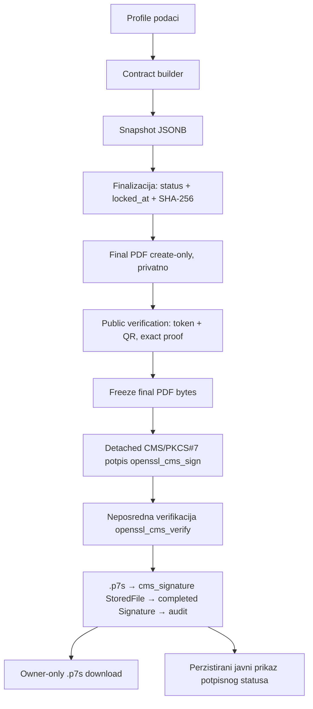

# Signing and verification — puni workflow i sigurnosne granice

Lokalni akademski detached CMS/PKCS#7 potpis nad zamrznutim finalnim PDF-om. Provjera kroz
PHP `ext-openssl`. **Nije** PAdES/eIDAS/QES i nema pravnu snagu.

## Local signer provisioning

Radi samo u `local`/`testing`; u produkciji odbijeno.

```bash
php artisan signing:provision-local-signer <USER_ID>
```

Kreira (u `storage/app/private/signing/local`, gitignored) — samo nazivi/purpose:

| Datoteka | Uloga |
|---|---|
| `test-root-ca.pem` | lokalni testni Root CA certifikat (trust anchor) |
| `test-root-ca-key.pem` | provisioning-only CA privatni ključ (nikad u signing runtimeu) |
| `test-signer-cert.pem` | javni signer certifikat |
| `test-signer-key.pem` | signer privatni ključ (zajednički za sve korisnike) |
| `test-signer-passphrase.txt` | passphrase datoteka |

Naredba registrira `certificates` redak (`is_active = true`) vezan uz korisnika kroz
`SignerCertificateRegistrar`. Ispis ne otkriva ključ, passphrase ni apsolutne putanje.

**Shared-key model:** jedan zajednički privatni ključ, per-user certifikat. Korisnik ne
posjeduje ključ; identitet potpisnika proizlazi iz autentikacije/autorizacije/binding/audita.
Bez non-repudiationa.

## Puni tok



### Ključne kontrole

- **Freeze-before-sign:** nakon što potpis postoji, final PDF i QR se **ne** regeneriraju
  (`FinalPdfIntegrityVerifier::assertNotActivelySigned()`), prije rendera i prije writea.
- **Exact source binding:** `source_file_id == contracts.final_pdf_file_id`; integritet
  PDF-a re-verificira se pod Contract lockom.
- **Exact token→PDF/QR proof:** signing traži aktivnu javnu provjeru (token, `enabled_at`,
  `revoked_at IS NULL`) i persisted proof (contract + file id + PDF SHA-256 +
  `generation_reason` + token SHA-256 + URL SHA-256). Timestamp nije dokaz.
- **Detached, nikad embedded:** `.p7s` je zaseban `cms_signature` `StoredFile`;
  `document_hash_before == document_hash_after`; PDF ni CMS artefakt se nikad ne
  overwriteaju.
- **Idempotency / concurrency:** DB partial unique `signatures_contract_user_source_active_unique`
  (`contract_id`, `signed_user_id`, `source_file_id`) je last-resort guard; klasifikator
  traži exact SQLSTATE `23505` + exact ime constrainta. Lock order `User(owner) → Contract`.

## Rute

| Metoda / ruta | Ime | Napomena |
|---|---|---|
| `POST /contracts/{contract}/sign` | `contracts.sign.store` | owner-only, CSRF, `throttle:6,1`, actor iz auth guarda |
| `GET /contracts/{contract}/signature/download` | `contracts.signature.download` | owner-only `.p7s`, exact binding + purpose/disk/size/SHA-256 prije slanja |
| `GET /verify/contracts/{token}` | `public.contracts.verify.show` | jedini javni contract endpoint, `throttle:20,1` (ključ = IP, nikad token) |

## Javni prikaz potpisnog statusa (8 odvojenih signala)

Read-only i fail-closed. Odvojeno prikazuje: integritet finalnog PDF-a, integritet potpisnog
artefakta, kriptografsku provjeru, povjerenje (lokalni testni Root CA), vremensku valjanost
certifikata, aktivnost certifikata, podudarnost otiska potpisnika, podudarnost source hasha.
Bez potpisa: neutralno „Dokument još nema dovršen digitalni potpis." Kad provjeru nije moguće
izvršiti, potpis se **ne** prikazuje kao valjan.

**Javna granica:** stranica ne otkriva certifikatni sadržaj, subject/issuer DN, serial,
privatnu putanju, download URL, token, PII ni PDF sadržaj. Prikazuje se samo **SHA-256
otisak** potpisnog certifikata (digest, ne tajna).

## Sigurnosne granice (sažetak)

- Privatna pohrana; owner authorization prije servisa; actor nikad iz requesta.
- Audit allow-list (`contract.signature_completed`, `contract.cms_signature_downloaded`):
  samo stabilni ID-evi i `*_sha256` digesti; nikad token/path/DN/serial/ključ/raw error.
- Certificate ambiguity (2+ aktivna) → fail-closed, bez gumba, bez metadata.
- Nikad ne tvrditi PAdES/eIDAS/QES/AdES/QSCD/QTSP, pravnu valjanost ni non-repudiation.

## Poznata ograničenja (P3)

- Stvarni paralelni PostgreSQL race test nije izveden (vidi [testing.md](testing.md)).
- Concurrent filesystem-swap TOCTOU residual; Windows ACL nad signing rootom; `serve => true`
  storage ruta bez temporary URL-a; shared local-test key (namjerno); provisioning-only CA
  key na disku; stari `dsmd-dev-signer` cleanup. Sve namjerno izvan M13 scopea.
