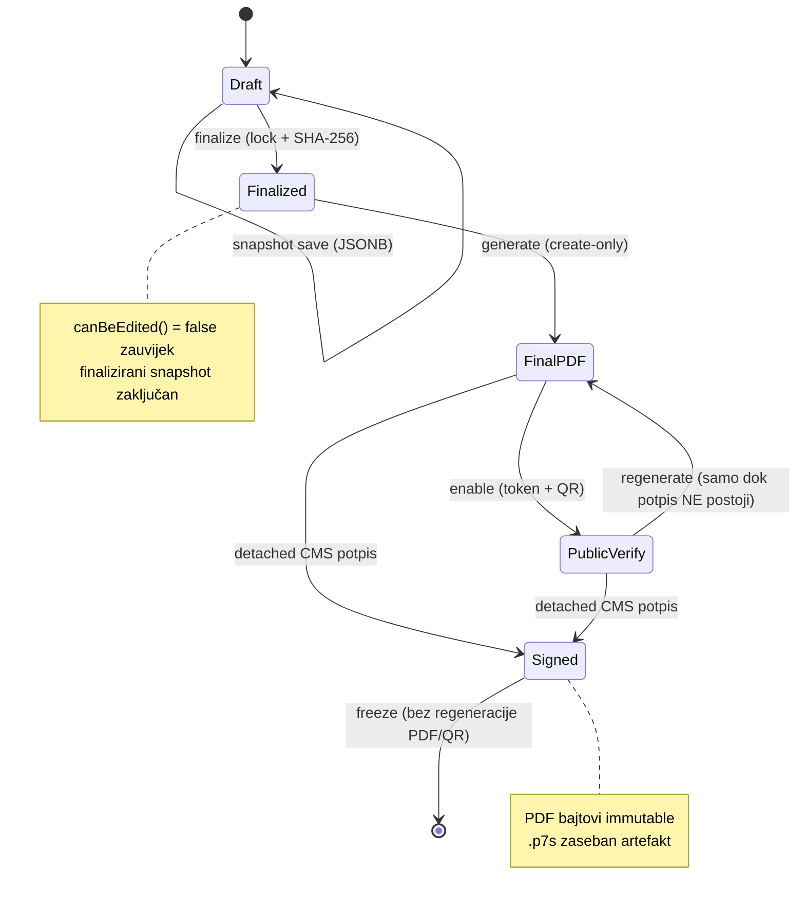

# Document lifecycle — dokazna građa

Aktivni contract workflow potvrđen iz `ContractController`, `FinalPdfGenerator` i ruta.

## Faze

1. **Draft** — `GET /contracts/create`, `GET /contracts/{contract}/builder`. Uređivanje
   dopušteno dok `canBeEdited() = isDraft() && ! isLocked()`.
2. **Snapshot** — `POST /contracts/snapshot`. Validira flat payload (OIB `^\d{11}$`, VIN
   `^[A-HJ-NPR-Z0-9]{17}$`, cijena, datum), sprema `filled_data_snapshot` (JSONB), auditira
   SHA-256 (ne perzistira draft hash na retku).
3. **Validacija** — `GET /contracts/{contract}/validate-required-fields` (advisory; isti
   validator autoritativno ponovno radi u finalizaciji).
4. **Finalizacija** — `POST /contracts/{contract}/finalize`. Unutar transakcije s
   `lockForUpdate()`: `status = finalized`, `locked_at`, `finalized_at`,
   `finalized_snapshot_sha256`. **Immutability boundary** — nema unlock puta.
5. **Final PDF** — `POST /contracts/{contract}/final-pdf`. Create-only: novi path + novi
   `StoredFile`; byte-equality + size + SHA-256 prije DB upisa; `assertNotActivelySigned()`
   odbija regeneraciju nad potpisanim artefaktom.
6. **Public verification** — `POST /contracts/{contract}/public-verification` (enable, QR
   embed), `GET /verify/contracts/{token}` (guest, non-enumerating 404, `throttle:20,1`).

## Dijagram

## Integritetska garancija

- Row-lock + re-validacija u finalizaciji; trajni `locked_at`/status bez revert puta;
  neovisna hash re-provjera pri svakoj PDF generaciji (`verifiedSnapshot()`).
- Ako `filled_data_snapshot` divergira od zapisanog hasha nakon finalizacije,
  `FinalPdfGenerator` odbija generirati PDF (422).
- Od M11: artefaktna immutabilnost — create-only + `assertNotActivelySigned()`.

## Ograničenja

- Revocation stupac (`public_verification_revoked_at`) postoji i provjerava se, ali nijedna
  ruta ga ne postavlja (nema revoke UI-ja) — namjerno izvan scopea.
- „Finalizacija" je application-level lock + SHA-256, **nije** kriptografski potpis.
