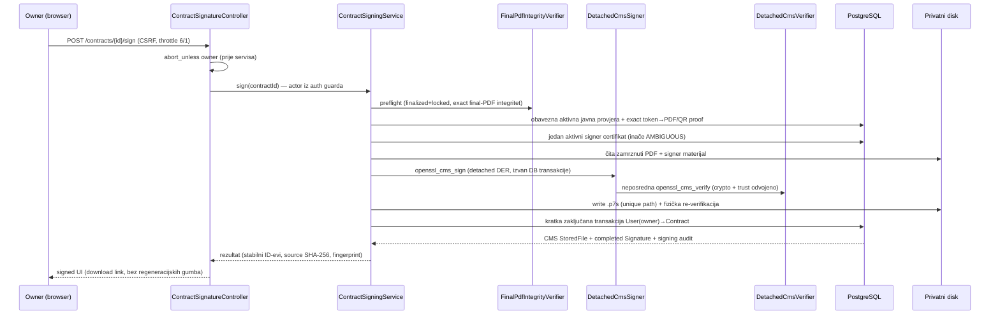
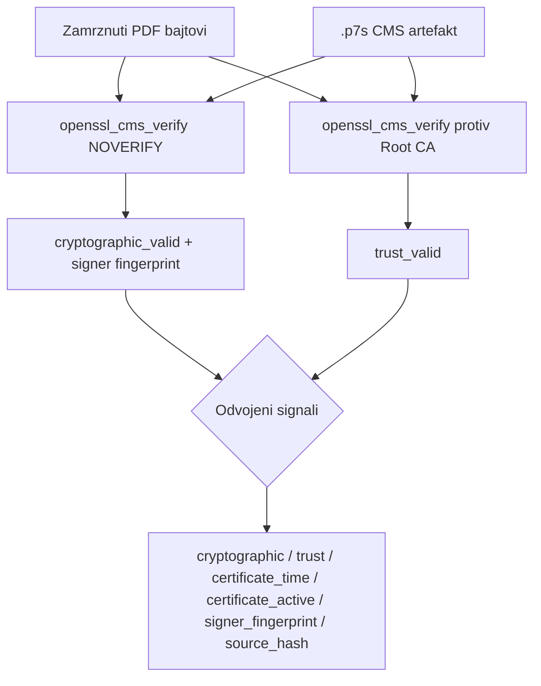

# Signing lifecycle — dokazna građa

Detached CMS/PKCS#7 potpis nad zamrznutim finalnim PDF-om. Native PHP `ext-openssl`
(`openssl_cms_sign` / `openssl_cms_verify`), bez CLI-a i bez string concatenationa.

## Sequence (potpisivanje)

## Verifikacija (dva native poziva)

`OPENSSL_CMS_NOVERIFY` se koristi **samo** za izolaciju crypto signala i izvlačenje signer
certifikata — nikad kao trust rezultat.

## Invarijante (dokazano testovima)

- `document_hash_before == document_hash_after` (isti SHA-256 potpisanog PDF-a); CMS artefakt
  ima vlastiti `StoredFile` hash.
- `source_file_id == contracts.final_pdf_file_id` (exact binding; aplikacijski ugovor).
- Freeze-before-sign: nema regeneracije PDF/QR nakon potpisa.
- Partial unique `signatures_contract_user_source_active_unique` — fizički dokazan na
  PostgreSQL-u (blokira drugi pending, completed-when-pending, drugi completed).
- Negativni scenariji: tamper PDF/CMS bajta, wrong Root CA, wrong key, wrong passphrase,
  neaktivan/istekao/not-yet-valid cert — svi odbijeni.

## Granica tvrdnji

Lokalna testna CMS/PKCS#7 demonstracija sa self-signed testnim trust anchorom. Nije
PAdES/CAdES/eIDAS/AdES/QES/QSCD/QTSP; nije embedded (detached); nema pravnu snagu ni
non-repudiation. Potpisnik je tehnički vlasnik zapisa (`signed_user_id`), nikad dokaz da je
prodavatelj/kupac potpisao. Shared-key model: korisnik ne posjeduje privatni ključ.
